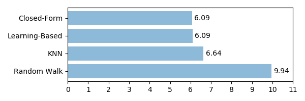
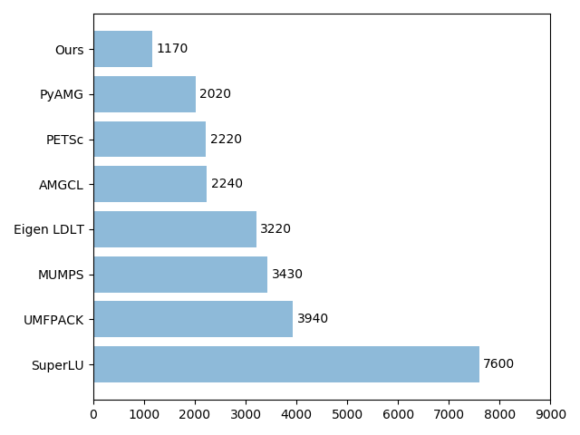

****************************
Benchmarks and Visualization
****************************

Quality
#######

To evaluate the performance of our implementation we calculate the mean squared error on the unknown pixels of the benchmark images of :cite:`rhemann2009perceptually`. 

.. _laplacians_quality_many_bars:
.. figure:: figures/laplacian_quality_many_bars.png
   :align: center
	    
   Figure 1: Mean squared error of the estimated alpha matte to the ground truth alpha matte.

.. _laplacians:

   Figure 2: Mean squared error across all images from the benchmark dataset.

Visualization
##############

The following videos show the iterates of the different methods. Note that the videos are timewarped.

   .. raw:: html
	    
      <table style="width:100%">
	 <tr align="center">
	 <td>
	 <embed>
	   <video width="320" height="180" loop autoplay muted playsinline>
	   <source src="https://github.com/pymatting/videos/blob/master/cf_web.mp4?raw=true" type="video/mp4">
	   </video>
	 </embed>
         </td>
	 <td>
	 <embed>
	   <video width="320" height="180" loop autoplay muted playsinline>
	   <source src="https://github.com/pymatting/videos/blob/master/knn_web.mp4?raw=true" type="video/mp4">
	 </video>
	 </embed>
	 </td> 
	 </tr>
	 <tr align="center">
	 <td>CF</td>
	 <td>KNN</td> 
	 </tr>
	 <tr align="center">
	 <td><embed>
	   <video width="320" height="180" loop autoplay muted playsinline>
	   <source src="https://github.com/pymatting/videos/blob/master/lkm_web.mp4?raw=true" type="video/mp4">
	   </video>
	 </embed>
	 </td>
	 <td>
	 <embed>
	   <video width="320" height="180" loop autoplay muted playsinline>
	   <source src="https://github.com/pymatting/videos/blob/master/rw_web.mp4?raw=true" type="video/mp4">
	   </video>
	 </embed>
	 </td> 
	 </tr>
	 <tr align="center">
	 <td>LKM</td>
	 <td>RW</td> 
	 </tr>
      </table>

Performance
###########

We compare the computational runtime of our solver with other solvers: pyAMG, UMFPAC, AMGCL, MUMPS, Eigen and SuperLU. Figure 3 shows that our implemented conjugate gradients method in combination with the incomplete Cholesky decomposition preconditioner outperforms the other methods by a large margin. For the iterative solver we used an absolute tolerance of :math:`10^{-7}`, which we scaled with the number of known pixels, i.e. pixels that are either marked as foreground or background in the trimap.

.. _time_image_size:
.. figure:: figures/time_image_size.png
   :align: center
	    
   Figure 3: Comparison of runtime for different image sizes.

.. _average_running_time:
.. figure:: figures/average_running_time.png
   :align: center
	    
   Figure 4: Peak memory for each solver usage in MB.

.. _average_preak_memory_usage:

	    
   Figure 5: Mean running time of each solver in seconds.
   
