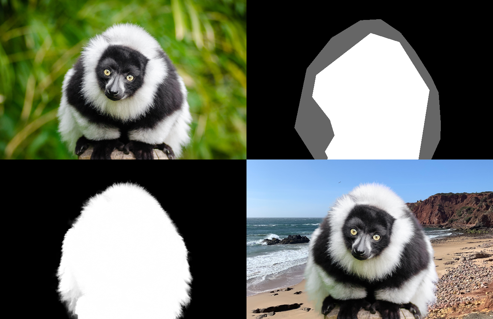

Introduction
============

Alpha Matting
-------------

For an image :math:`I` with foreground pixels :math:`F` and background :math:`B` the alpha matting problem aims to determine opacities :math:`\alpha`, such that the equality

.. math::
   I = \alpha F +(1-\alpha)B
   
holds. This problem is inherently ill-posed since for each pixel we have three equations with seven unknown variables. The alpha matte :math:`\alpha` determine how much a pixel contributes to the foreground and how much to the background of an image.

After estimating the alpha matte :math:`\alpha` the foreground pixels and background pixels can be estimated. We refer to this process as foreground estimation.

   Figure 1: Input image, input trimap, estimated alpha and extracted foreground.

To estimate the alpha matte Pymatting implements the following methods:

* Closed-form matting :cite:`levin2007closed`
* KNN matting :cite:`chen2013knn`
* Large kernel matting :cite:`he2010fast`
* Learning-based matting :cite:`zheng2009learning`
* Random-walk matting :cite:`grady2005random`

Foreground Extraction
---------------------

Simply multiplying the alpha matte with the input image results in halo artifacts. This motivates the developement of foreground extraction methods.

.. figure:: figures/lemur_color_bleeding.png
   :align: center

   Figure 2: Input image naively composed onto a grey background (left) and extracted foreground placed onto the same background (right).

The following foreground estimation methods are implemented in PyMatting:

* Closed-form foreground estimation :cite:`levin2007closed`
* Multilevel approach :cite:`germer2020multilevel`
